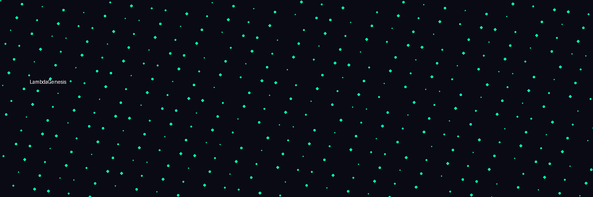

# LambdaGenesis

> Artificial Life • Symbolic Chemistry • Computational Abiogenesis • Emergent Cognition


---

## Overview

LambdaGenesis is an artificial life substrate inspired by:

- AlChemy
- artificial chemistries
- autocatalytic sets
- lambda calculus ecologies
- computational abiogenesis
- symbolic ecosystems
- emergent cognition

The project explores whether adaptive self-organizing computational structures can emerge from:

- symbolic interaction
- mutation
- energy economics
- ecological dynamics
- catalytic transformation
- persistent organization

---

## Core Idea

Lambda expressions behave like computational molecules.

These molecules:

- interact
- mutate
- decay
- catalyze
- replicate
- compete for energy

The goal is to investigate:

> how persistent adaptive symbolic ecologies emerge from simple computational rules.

---

## Architecture

```text
Symbolic Molecules
        ↓
Reaction Rules
        ↓
Artificial Chemistry
        ↓
Autocatalytic Structures
        ↓
Persistent Ecologies
        ↓
Adaptive Symbolic Systems
```

---

## Features

- symbolic chemistry engine
- mutation system
- energy decay dynamics
- catalytic recombination
- emergent ecology simulation
- live terminal visualization
- extensible ALife substrate

---

## Quickstart

```bash
source .venv/bin/activate
python run.py
```

---

## Repository Structure

```text
src/lambdagenesis/
├── chemistry/
├── core/
├── visualization/
├── agents/
└── utils/
```

---

## Research Questions

- Can symbolic chemistry self-organize?
- Can computational autocatalysis emerge?
- Can persistent structures evolve?
- What creates open-ended symbolic complexity?
- Can ecological memory arise naturally?

---

## Inspiration

- AlChemy
- Tierra
- Avida
- Lenia
- OpenWorm
- artificial chemistry research
- origin-of-life theory

---

## Future Directions

- graph rewriting systems
- typed lambda chemistry
- neural-symbolic hybrids
- developmental morphogenesis
- ecological specialization
- emergent communication
- multi-agent tool evolution
- symbolic memory systems

---

## Simulation Preview



---

## License

MIT
